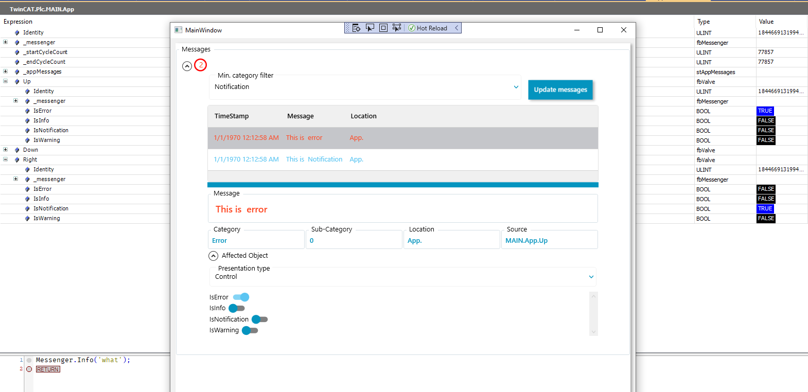

## How to use diagnostics tools

First of all setup this in your C# code you have to enable diagnostics
```csharp
MAIN.App.SetUp.WithMessaging();
```

To use messenger to its full potential it's recommended to extend from `VortexBase.fbVortexer`. This way you get full traceability of the system. 

All you have to do is to use `Messenger.Post` method or a helper method like `Messenger.Error` which will post an error without specifying a category. 

```pascal
FUNCTION_BLOCK fbValve EXTENDS VortexBase.fbVortexer
VAR
	IsError:BOOL;
	IsInfo:BOOL;
	IsNotification:BOOL;
	IsWarning:BOOL;
END_VAR
---
IF IsError THEN
	Messenger.Post('This is  error',enumMessageCategory.Error);
END_IF

IF IsInfo THEN
	Messenger.Post('This is  Info',enumMessageCategory.Info);
END_IF

IF IsNotification THEN
	Messenger.Post('This is  Notification',enumMessageCategory.Notification);
END_IF

IF IsWarning THEN
	Messenger.Post('This is  Warning',enumMessageCategory.Warning);
END_IF
```


To display the messages on your HMI use the well known 
```xaml
<vortex:RenderableContentControl DataContext="{Binding MAIN.App._appMessages}" />
```

### Result
When you click on the message you can see the **source** of the message. In this case, we have an error from the *Up valve* and an info message from the *Right valve*.

After you select another message you can see that the source of the message updates as well. You can also immediately use the auto-generated UI of the component. If you created your view for the structure it will display accordingly. 

